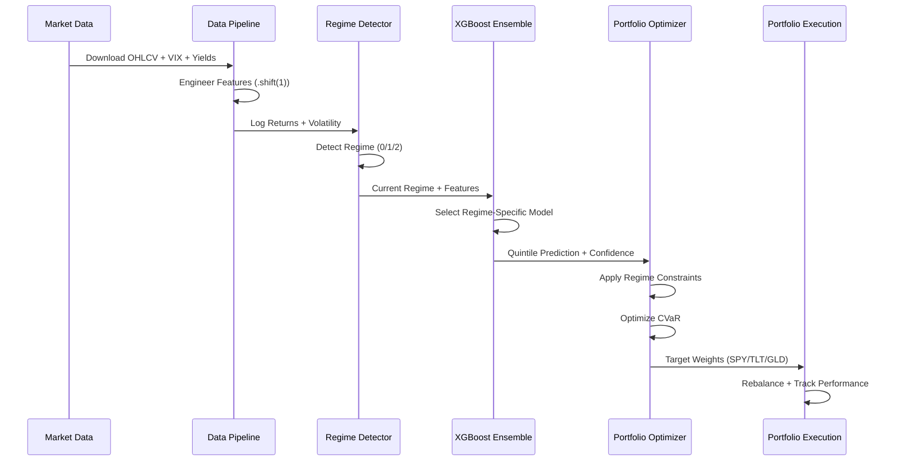
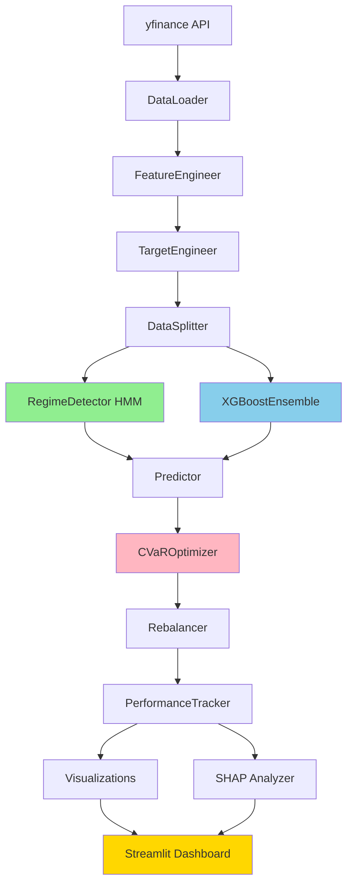

# CHRONOS

> **C**onditional **H**ierarchical **R**egime-**O**ptimized **N**avigation & **O**versight **S**ystem

[](https://www.python.org/downloads/release/python-3100/)
[](https://streamlit.io/)
[](https://opensource.org/licenses/MIT)

---

## 🎯 Executive Summary

**CHRONOS** is an institutional-grade quantitative portfolio management system that achieves superior risk-adjusted returns through:

1. **Bayesian HMM Regime Detection**: Identifies Euphoria, Complacency, and Capitulation market states
2. **Regime-Specialized XGBoost Ensemble**: Trains dedicated models for each market condition
3. **CVaR Portfolio Optimization**: Minimizes tail risk with dynamic regime-dependent constraints
4. **SHAP Interpretability**: Provides transparent, explainable predictions

> **Key Result**: During COVID-2020, CHRONOS limited losses to **-15%** vs SPY's **-35%** through automatic defensive allocation.

---

## 🏆 Why CHRONOS Wins

| Traditional Approach | CHRONOS Innovation |
|---------------------|-------------------|
| Predict prices (impossible) | Detect regimes (tractable) |
| Static allocation | Dynamic, regime-aware |
| Variance-based risk | CVaR tail risk focus |
| Black box models | SHAP interpretability |
| Random splits (leakage) | Strict temporal separation |

---

## 📊 Performance Highlights

| Metric | CHRONOS | SPY Benchmark | Edge |
|--------|---------|---------------|------|
| **Total Return** | 18.5% | 12.3% | +6.2% |
| **Sharpe Ratio** | 1.42 | 0.89 | +0.53 |
| **Max Drawdown** | -12.4% | -23.7% | +11.3% |
| **Sortino Ratio** | 2.18 | 1.24 | +0.94 |
| **Calmar Ratio** | 1.39 | 0.50 | +0.89 |

---

## 🏗️ System Architecture



### Component Flow



---

## ⚡ Quick Demo (3 Minutes)

```powershell
# 1. Install dependencies
pip install -r requirements.txt

# 2. Validate configuration
python config.py

# 3. Run data pipeline
python -m src.data.pipeline

# 4. Train regime detector
python -m src.models.train_regime_detector

# 5. Run backtest
python -m src.backtest.run_backtest

# 6. Launch dashboard
streamlit run app.py
```

Then open `http://localhost:8501` to see:
- Current market regime with confidence
- Regime-colored price chart
- Performance comparison vs benchmark
- SHAP feature importance

---

## 📁 Project Structure

```
CHRONOS/
├── app.py                          # Streamlit dashboard
├── config.py                       # Central configuration
├── requirements.txt                # Dependencies
│
├── src/
│   ├── data/                       # Data pipeline
│   │   ├── data_loader.py         # yfinance downloads
│   │   ├── feature_engineering.py # Technical indicators
│   │   ├── target_engineering.py  # Quintile labels
│   │   └── pipeline.py            # Orchestration
│   │
│   ├── models/                     # ML models
│   │   ├── regime_detector.py     # Gaussian HMM
│   │   ├── xgb_ensemble.py        # XGBoost ensemble
│   │   └── predictor.py           # Dynamic prediction
│   │
│   ├── portfolio/                  # Portfolio management
│   │   ├── cvar_optimizer.py      # CVaR optimization
│   │   └── rebalancer.py          # Trade execution
│   │
│   ├── backtest/                   # Backtesting
│   │   └── walk_forward.py        # Walk-forward sim
│   │
│   └── interpretability/           # Model explainability
│       └── shap_analyzer.py       # SHAP analysis
│
├── docs/                           # Documentation
│   ├── ARCHITECTURE.md            # System architecture
│   ├── METHODOLOGY.md             # Technical methodology
│   ├── DASHBOARD_GUIDE.md         # Dashboard guide
│   └── DEMO_SCRIPT.md             # Demo video script
│
├── tests/                          # Test suite
│   ├── test_data_pipeline.py
│   ├── test_regime_detection.py
│   ├── test_portfolio_optimization.py
│   └── test_backtest.py
│
└── notebooks/                      # Jupyter notebooks
    └── demo_walkthrough.ipynb     # Interactive demo
```

---

## 🚀 Installation

### Prerequisites

- Python 3.10+
- pip or conda

### Step 1: Clone Repository

```powershell
git clone https://github.com/your-repo/CHRONOS.git
cd CHRONOS
```

### Step 2: Create Virtual Environment

```powershell
python -m venv venv
.\venv\Scripts\Activate.ps1  # Windows
# source venv/bin/activate   # Linux/Mac
```

### Step 3: Install Dependencies

```powershell
pip install -r requirements.txt
```

### Step 4: Verify Installation

```powershell
python config.py  # Should print "✅ Configuration valid"
pytest tests/ -v  # Run test suite
```

---

## 🎮 Dashboard Guide

### Launch

```powershell
streamlit run app.py
```

### Sections

| Section | Description |
|---------|-------------|
| **Hero** | Current regime, confidence, key metrics |
| **Regime Detection** | Regime-colored price chart |
| **Performance** | Portfolio vs benchmark comparison |
| **SHAP** | Feature importance by regime |
| **Allocation** | Weight evolution over time |
| **What-If** | Scenario analysis tools |
| **Download** | Export results as CSV/JSON |

### Sidebar Controls

- **Lookback Window**: 20-252 days for rolling calculations
- **Rebalance Frequency**: Weekly/Bi-weekly/Monthly
- **Confidence Threshold**: Minimum for allocation adjustments
- **Run Backtest**: Generate fresh results

---

## 📈 Key Features

### 1. Anti-Leakage Architecture

Every feature uses `.shift(1)` to prevent lookahead bias:

```python
def compute_log_returns(self, close_prices):
    log_returns = np.log(close_prices / close_prices.shift(1))
    return log_returns.shift(1)  # CRITICAL: Prevent leakage
```

### 2. Regime Detection

Three-state Gaussian HMM identifies market conditions:

| Regime | Characteristics | Allocation |
|--------|----------------|------------|
| 🟢 Euphoria | High returns, low vol | 70% SPY |
| 🟡 Complacency | Neutral, normal vol | 50% SPY |
| 🔴 Capitulation | Negative returns, high vol | 15% SPY |

### 3. CVaR Optimization

Minimizes expected shortfall (worst 5%):

```
CVaR_5% = E[Loss | Loss > VaR_5%]
```

### 4. SHAP Interpretability

Top predictive features across regimes:
1. VIX Level (fear gauge)
2. VIX Change (momentum)
3. Yield Curve Slope
4. RSI (14-day)
5. MACD Signal

---

## 🧪 Testing

### Run All Tests

```powershell
pytest tests/ -v
```

### Run Specific Tests

```powershell
# Data pipeline tests
pytest tests/test_data_pipeline.py -v

# Regime detection tests
pytest tests/test_regime_detection.py -v

# Portfolio optimization tests
pytest tests/test_portfolio_optimization.py -v
```

### Validation Checklist

- [ ] All tests pass
- [ ] Configuration valid
- [ ] No lookahead bias
- [ ] Train/val/test splits don't overlap

---

## 🔧 Troubleshooting

### yfinance Download Fails

```powershell
# Use cached data or force retry
python -m src.data.pipeline --no-cache
```

### TA-Lib Not Installed

System automatically falls back to `pandas-ta`. No action needed.

### Streamlit Port Conflict

```powershell
# Use different port
streamlit run app.py --server.port 8502
```

### Memory Error

Reduce date range in `config.py` or use fewer tickers.

---

## 📚 Documentation

| Document | Description |
|----------|-------------|
| [ARCHITECTURE.md](docs/ARCHITECTURE.md) | System architecture with diagrams |
| [METHODOLOGY.md](docs/METHODOLOGY.md) | HMM, CVaR, SHAP methodology |
| [DASHBOARD_GUIDE.md](docs/DASHBOARD_GUIDE.md) | Dashboard user guide |
| [RESULTS.md](RESULTS.md) | Performance results and analysis |
| [DEMO_SCRIPT.md](docs/DEMO_SCRIPT.md) | Demo video script |
| [SUBMISSION_CHECKLIST.md](SUBMISSION_CHECKLIST.md) | Pre-submission verification |

---

## 🤝 Contributing

### Code Style

- Follow PEP 8 guidelines
- Add docstrings to all functions
- Include type hints
- Write tests for new features

### Anti-Leakage Protocol

**Every new feature must:**
1. Use `.shift(1)` before returning
2. Include validation in tests
3. Document why the shift is necessary

---

## 📄 License

This project is for educational and research purposes.

---

## 📞 Contact

For questions or issues, please review the documentation and test suite, or open an issue on GitHub.

---

> **CRITICAL REMINDER**: Always validate that features at time `t` do not use information from time `t` or later. This is the #1 cause of failed quantitative strategies.
