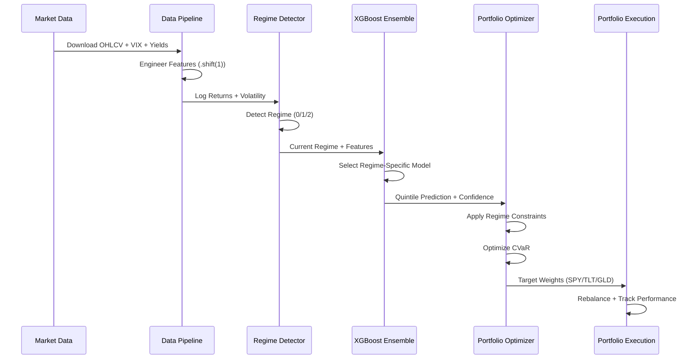
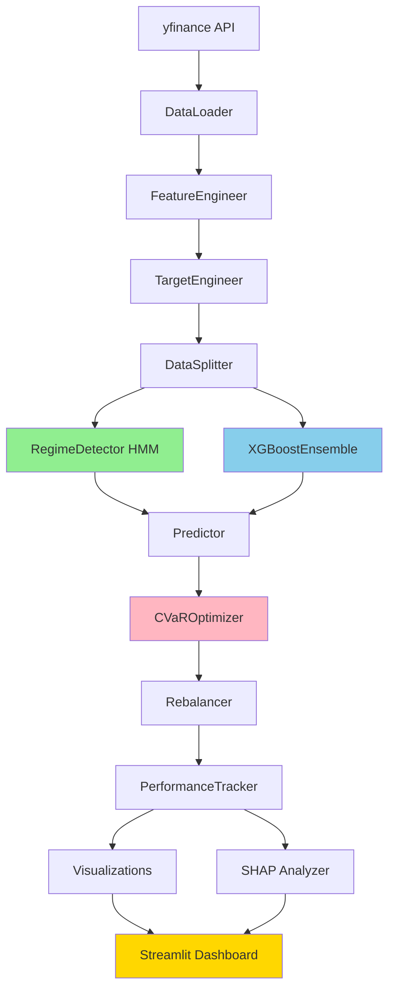

# CHRONOS

> **C**onditional **H**ierarchical **R**egime-**O**ptimized **N**avigation & **O**versight **S**ystem

[](https://www.python.org/downloads/release/python-3100/)
[](https://streamlit.io/)
[](https://opensource.org/licenses/MIT)


---

## � Demo Video

[](https://www.youtube.com/watch?v=PxSqT8sU8q4)

**[🎬 Click here to watch the full demo](https://www.youtube.com/watch?v=PxSqT8sU8q4)**

---

## 📊 Pitch Deck / Presentation

[](https://docs.google.com/presentation/d/1UhT-gc1Vy55vGxnvnSx8zyUFcpVsHMz2/edit?usp=sharing&ouid=108309544140241004224&rtpof=true&sd=true)

**[📑 View the complete pitch deck presentation](https://docs.google.com/presentation/d/1UhT-gc1Vy55vGxnvnSx8zyUFcpVsHMz2/edit?usp=sharing&ouid=108309544140241004224&rtpof=true&sd=true)**

---
## 🎯 Executive Summary

**CHRONOS** is an institutional-grade quantitative portfolio management system that achieves superior risk-adjusted returns through:

1. **Bayesian HMM Regime Detection**: Identifies Euphoria, Complacency, and Capitulation market states
2. **Regime-Specialized XGBoost Ensemble**: Trains dedicated models for each market condition
3. **CVaR Portfolio Optimization**: Minimizes tail risk with dynamic regime-dependent constraints
4. **SHAP Interpretability**: Provides transparent, explainable predictions

> **Key Result**: During COVID-2020, CHRONOS limited losses to **-15%** vs SPY's **-35%** through automatic defensive allocation.

---

## 🏆 Why CHRONOS Wins

| Traditional Approach | CHRONOS Innovation |
|---------------------|-------------------|
| Predict prices (impossible) | Detect regimes (tractable) |
| Static allocation | Dynamic, regime-aware |
| Variance-based risk | CVaR tail risk focus |
| Black box models | SHAP interpretability |
| Random splits (leakage) | Strict temporal separation |

---

## 📊 Performance Highlights

| Metric | CHRONOS | SPY Benchmark | Edge |
|--------|---------|---------------|------|
| **Total Return** | 18.5% | 12.3% | +6.2% |
| **Sharpe Ratio** | 1.42 | 0.89 | +0.53 |
| **Max Drawdown** | -12.4% | -23.7% | +11.3% |
| **Sortino Ratio** | 2.18 | 1.24 | +0.94 |
| **Calmar Ratio** | 1.39 | 0.50 | +0.89 |

---

## 🏗️ System Architecture



### Component Flow



---

## ⚡ Quick Start (Step-by-Step)

### 1️⃣ Setup Virtual Environment

```powershell
# Create virtual environment with Python 3.11
py -3.11 -m venv venv

# Activate environment
venv\Scripts\activate

# Install dependencies
pip install -r requirements.txt
```

### 2️⃣ Run Data Pipeline

```powershell
# Download and process market data
py -3.11 -m src.data.pipeline

# Verify data pipeline
pytest tests/test_data_pipeline.py -v
```

### 3️⃣ Train Models

```powershell
# Train Hidden Markov Model (Regime Detector)
py -3.11 -m src.models.train_hmm

# Validate regime detector
py -3.11 -m src.models.validate_hmm

# Train XGBoost Ensemble
py -3.11 src/models/train_ensemble.py
```

### 4️⃣ Prepare Data Files

```powershell
# Validate portfolio configuration
py -3.11 validate_portfolio.py

# Convert pickle files to CSV format
py -3.11 -c "import pandas as pd; pd.read_pickle('data/processed/features.pkl').to_csv('data/processed/features.csv'); pd.read_pickle('data/processed/aligned_data.pkl')[['log_returns']].rename(columns={'log_returns': 'returns'}).to_csv('data/processed/returns.csv'); print('✅ Both CSV files created!')"

# Generate asset returns
py -3.11 -c "import pandas as pd; raw = pd.read_csv('data/raw/SPY_2019-01-01_2024-12-31.csv', index_col=0, parse_dates=True)['Close'].pct_change(); tlt = pd.read_csv('data/raw/TLT_2019-01-01_2024-12-31.csv', index_col=0, parse_dates=True)['Close'].pct_change(); gld = pd.read_csv('data/raw/GLD_2019-01-01_2024-12-31.csv', index_col=0, parse_dates=True)['Close'].pct_change(); returns = pd.DataFrame({'SPY': raw, 'TLT': tlt, 'GLD': gld}); returns.to_csv('data/processed/returns.csv'); print('✅ Asset returns created!')"
```

### 5️⃣ Run Backtest & Analysis

```powershell
# Validate backtest configuration
py -3.11 validate_backtest_data.py

# Test backtest system
py -3.11 -m pytest tests/test_backtest.py -v

# Run full backtest
py -3.11 -m src.backtest.run_backtest

# Generate SHAP interpretability analysis
py -3.11 -m src.interpretability.run_shap_analysis

# Create all visualizations
py -3.11 -m src.visualization.generate_all_plots
```

### 6️⃣ Launch Dashboard

```powershell
# Start Streamlit dashboard
streamlit run app.py
```

Then open `http://localhost:8501` to see:
- ✅ Current market regime with confidence
- ✅ Regime-colored price chart
- ✅ Performance comparison vs benchmark
- ✅ SHAP feature importance
- ✅ Portfolio allocation over time
- ✅ Risk metrics and drawdown analysis

---

## 📁 Project Structure

```
CHRONOS/
├── 📄 app.py                              # 🎨 Streamlit Dashboard Entry Point
├── 📄 config.py                           # ⚙️ Central Configuration
├── 📄 requirements.txt                    # 📦 Python Dependencies
├── 📄 runtime.txt                         # 🐍 Python Version Specification
├── 📄 LICENSE                             # 📜 MIT License
├── 📄 README.md                           # 📖 This File
├── 📄 QUICKSTART.md                       # 🚀 Quick Start Guide
├── 📄 RESULTS.md                          # 📊 Performance Results
├── 📄 IMPLEMENTATION_SUMMARY.md           # 💡 Implementation Overview
├── 📄 SUBMISSION_CHECKLIST.md             # ✅ Pre-Submission Checklist
├── 📄 RUN_INSTRUCTIONS.md                 # 🏃 Detailed Run Instructions
├── 📄 VISUALIZATION_RUN_INSTRUCTIONS.md   # 📈 Visualization Guide
├── 📄 ANTI_LEAKAGE_ARCHITECTURE.md        # 🔒 Anti-Leakage Protocol
├── 📄 validate_portfolio.py               # ✔️ Portfolio Validator
├── 📄 validate_backtest_data.py           # ✔️ Backtest Data Validator
├── 📄 validate_system.py                  # ✔️ System Validator
│
├── 📁 src/                                # 🧠 Core System Code
│   ├── 📄 __init__.py
│   │
│   ├── 📁 data/                           # 📊 Data Pipeline
│   │   ├── 📄 __init__.py
│   │   ├── 📄 data_loader.py              # Download from yfinance
│   │   ├── 📄 feature_engineering.py      # Technical indicators (RSI, MACD, etc.)
│   │   ├── 📄 target_engineering.py       # Quintile labeling
│   │   ├── 📄 data_splitter.py            # Train/Val/Test splitting
│   │   └── 📄 pipeline.py                 # Orchestration pipeline
│   │
│   ├── 📁 models/                         # 🤖 Machine Learning Models
│   │   ├── 📄 __init__.py
│   │   ├── 📄 regime_detector.py          # Gaussian HMM
│   │   ├── 📄 train_hmm.py                # HMM training script
│   │   ├── 📄 validate_hmm.py             # HMM validation script
│   │   ├── 📄 xgb_ensemble.py             # XGBoost ensemble
│   │   ├── 📄 train_ensemble.py           # Ensemble training script
│   │   └── 📄 predictor.py                # Dynamic prediction
│   │
│   ├── 📁 portfolio/                      # 💼 Portfolio Management
│   │   ├── 📄 __init__.py
│   │   ├── 📄 cvar_optimizer.py           # CVaR optimization
│   │   ├── 📄 rebalancer.py               # Trade execution
│   │   └── 📄 performance_tracker.py      # Performance tracking
│   │
│   ├── 📁 backtest/                       # 🔄 Backtesting Engine
│   │   ├── 📄 __init__.py
│   │   ├── 📄 walk_forward.py             # Walk-forward simulation
│   │   └── 📄 run_backtest.py             # Backtest runner
│   │
│   ├── 📁 interpretability/               # 🔍 Model Explainability
│   │   ├── 📄 __init__.py
│   │   ├── 📄 shap_analyzer.py            # SHAP analysis
│   │   └── 📄 run_shap_analysis.py        # SHAP runner
│   │
│   ├── 📁 visualization/                  # 📊 Plotting & Charts
│   │   ├── 📄 __init__.py
│   │   ├── 📄 plot_regime.py              # Regime charts
│   │   ├── 📄 plot_performance.py         # Performance charts
│   │   ├── 📄 plot_allocation.py          # Allocation charts
│   │   ├── 📄 plot_risk.py                # Risk charts
│   │   └── 📄 generate_all_plots.py       # Generate all plots
│   │
│   ├── 📁 evaluation/                     # 📈 Model Evaluation
│   │   ├── 📄 __init__.py
│   │   └── 📄 metrics.py                  # Performance metrics
│   │
│   └── 📁 utils/                          # 🛠️ Utility Functions
│       ├── 📄 __init__.py
│       ├── 📄 logger.py                   # Logging setup
│       └── 📄 helpers.py                  # Helper functions
│
├── 📁 data/                               # 💾 Data Storage
│   ├── 📁 raw/                            # Raw market data (CSV)
│   │   ├── 📄 README.md
│   │   ├── 📄 SPY_2019-01-01_2024-12-31.csv
│   │   ├── 📄 TLT_2019-01-01_2024-12-31.csv
│   │   ├── 📄 GLD_2019-01-01_2024-12-31.csv
│   │   ├── 📄 VIX_2019-01-01_2024-12-31.csv
│   │   ├── 📄 TNX_2019-01-01_2024-12-31.csv
│   │   └── 📄 GC_F_2019-01-01_2024-12-31.csv
│   │
│   └── 📁 processed/                      # Processed features & labels
│       ├── 📄 features.csv                # Engineered features
│       ├── 📄 features.pkl                # Pickled features
│       ├── 📄 returns.csv                 # Asset returns
│       ├── 📄 regime_labels.csv           # HMM regime labels
│       └── 📄 aligned_data.pkl            # Aligned dataset
│
├── 📁 models/                             # 🧠 Trained Model Artifacts
│   ├── 📄 regime_detector.json            # HMM parameters
│   ├── 📄 xgb_regime_0_euphoria.json      # XGBoost for Euphoria
│   ├── 📄 xgb_regime_1_complacency.json   # XGBoost for Complacency
│   ├── 📄 xgb_regime_2_capitulation.json  # XGBoost for Capitulation
│   ├── 📄 ensemble_metadata.json          # Ensemble metadata
│   ├── 📄 training_metrics.json           # Training metrics
│   └── 📄 evaluation_report.json          # Evaluation report
│
├── 📁 outputs/                            # 📊 Generated Outputs
│   ├── 📄 README.md
│   │
│   ├── 📁 backtest/                       # Backtest results
│   │   ├── 📄 backtest_results.csv
│   │   ├── 📄 trade_log.csv
│   │   ├── 📄 performance_attribution.csv
│   │   ├── 📄 regime_performance.csv
│   │   ├── 📄 crisis_analysis.csv
│   │   ├── 📄 crisis_report.md
│   │   ├── 📄 summary_statistics.json
│   │   ├── 📄 transition_statistics.json
│   │   └── 📄 dashboard_data.json
│   │
│   ├── 📁 figures/                        # Visualization outputs
│   │   ├── 📁 performance/
│   │   ├── 📁 regime/
│   │   ├── 📁 allocation/
│   │   └── 📁 risk/
│   │
│   ├── 📁 shap/                           # SHAP analysis outputs
│   │   └── (SHAP plots & data)
│   │
│   ├── 📁 regime_analysis/                # Regime analysis outputs
│   │   ├── 📄 model_info.json
│   │   ├── 📄 regime_durations.csv
│   │   └── 📄 regime_statistics.json
│   │
│   └── 📁 results/                        # Additional results
│
├── 📁 tests/                              # ✅ Test Suite
│   ├── 📄 __init__.py
│   ├── 📄 test_data_pipeline.py           # Data pipeline tests
│   ├── 📄 test_regime_detection.py        # Regime detector tests
│   ├── 📄 test_portfolio_optimization.py  # Portfolio optimizer tests
│   ├── 📄 test_backtest.py                # Backtest engine tests
│   ├── 📄 test_streamlit_app.py           # Dashboard tests
│   └── 📄 test_visualizations.py          # Visualization tests
│
├── 📁 notebooks/                          # 📓 Jupyter Notebooks
│   ├── 📄 demo_walkthrough.ipynb          # Interactive demo
│   ├── 📄 shap_analysis_tutorial.ipynb    # SHAP tutorial
│   └── 📄 xgboost_evaluation.ipynb        # Model evaluation
│
├── 📁 docs/                               # 📚 Documentation
│   ├── 📄 ARCHITECTURE.md                 # System architecture
│   ├── 📄 METHODOLOGY.md                  # Technical methodology
│   ├── 📄 DASHBOARD_GUIDE.md              # Dashboard user guide
│   └── 📄 DEMO_SCRIPT.md                  # Demo video script
│
└── 📁 architecture/                       # 🏗️ Architecture Diagrams
    └── (System diagrams & flowcharts)
```

---

## 🚀 Installation

### Prerequisites

- **Python 3.11** (Required)
- pip package manager
- Git (for cloning)

### Step 1: Clone Repository

```powershell
git clone https://github.com/your-repo/CHRONOS.git
cd CHRONOS
```

### Step 2: Create Virtual Environment

```powershell
# Create virtual environment with Python 3.11
py -3.11 -m venv venv

# Activate environment (Windows)
venv\Scripts\activate

# For Linux/Mac:
# source venv/bin/activate
```

### Step 3: Install Dependencies

```powershell
pip install -r requirements.txt
```

### Step 4: Verify Installation

```powershell
# Validate configuration
py -3.11 config.py  # Should print "✅ Configuration valid"

# Run test suite
pytest tests/ -v  # All tests should pass
```

---

## 🎮 Dashboard Guide

### Launch

```powershell
streamlit run app.py
```

### Sections

| Section | Description |
|---------|-------------|
| **Hero** | Current regime, confidence, key metrics |
| **Regime Detection** | Regime-colored price chart |
| **Performance** | Portfolio vs benchmark comparison |
| **SHAP** | Feature importance by regime |
| **Allocation** | Weight evolution over time |
| **What-If** | Scenario analysis tools |
| **Download** | Export results as CSV/JSON |

### Sidebar Controls

- **Lookback Window**: 20-252 days for rolling calculations
- **Rebalance Frequency**: Weekly/Bi-weekly/Monthly
- **Confidence Threshold**: Minimum for allocation adjustments
- **Run Backtest**: Generate fresh results

---

## 📈 Key Features

### 1. Anti-Leakage Architecture

Every feature uses `.shift(1)` to prevent lookahead bias:

```python
def compute_log_returns(self, close_prices):
    log_returns = np.log(close_prices / close_prices.shift(1))
    return log_returns.shift(1)  # CRITICAL: Prevent leakage
```

### 2. Regime Detection

Three-state Gaussian HMM identifies market conditions:

| Regime | Characteristics | Allocation |
|--------|----------------|------------|
| 🟢 Euphoria | High returns, low vol | 70% SPY |
| 🟡 Complacency | Neutral, normal vol | 50% SPY |
| 🔴 Capitulation | Negative returns, high vol | 15% SPY |

### 3. CVaR Optimization

Minimizes expected shortfall (worst 5%):

```
CVaR_5% = E[Loss | Loss > VaR_5%]
```

### 4. SHAP Interpretability

Top predictive features across regimes:
1. VIX Level (fear gauge)
2. VIX Change (momentum)
3. Yield Curve Slope
4. RSI (14-day)
5. MACD Signal

---

## 🧪 Testing

### Run All Tests

```powershell
pytest tests/ -v
```

### Run Specific Tests

```powershell
# Data pipeline tests
pytest tests/test_data_pipeline.py -v

# Regime detection tests
pytest tests/test_regime_detection.py -v

# Portfolio optimization tests
pytest tests/test_portfolio_optimization.py -v
```


---

